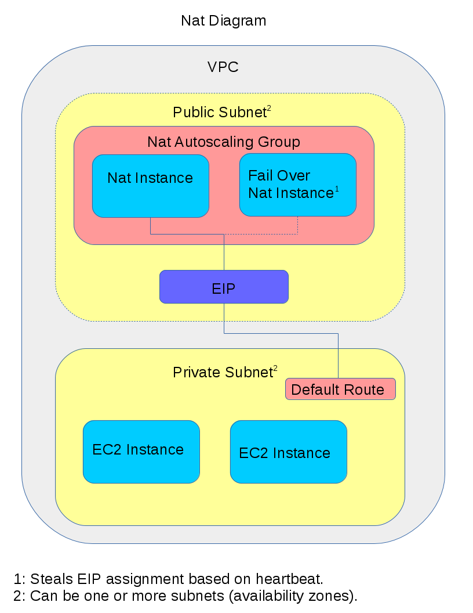

# nubis-nat
The nubis-nat project currently wraps a number of services into a single deployed instance type.

 - [Nat](#nat)
 - [Proxy](#proxy)
 - [NSM](#nsm)
 - [IP Blocklist](#ip-blocklist)

## Nat
The nat works as one might expect. We are simply using iptables source natting in the postrouting table.

In practice the nat instances update the default route for each subnet. There is a single NAT Auto Scaling Group (ASG) that has a desired and minimum value of two nats. If there are multiple Availability Zones (AZs) this ASG is deployed across them all. This provides a minimum level of redundancy due to the placement of EC2 instances within AZs, you can read about that [here](http://docs.aws.amazon.com/autoscaling/latest/userguide/as-instance-termination.html#default-termination-policy). When the NAT instances come online the first operational NAT instance assigns itself (its ENI) to the default route. All additional NAT instances monitor the primary NAT using a consul exclusive lock. If a node discovers the primary nat is no longer reporting healthy, it assigns the default route to itself. This provides for a minimum level of failover style redundancy.

We will, in short order, be adding statefull failover by using the netfilter [contrackd](http://conntrack-tools.netfilter.org/) tool.



## Proxy
This project is currently based around [Squid3](http://www.squid-cache.org/). As configured we are only taking advantage of the forward proxy abilities and none of the caching abilities. The default configuration is a logging only forward proxy, in other words there are no blocklists or allow lists deployed. There is a list of "safe ports" which are allowed, all others are blocked.

### Integrating
In order to make use of the proxies, your application must be proxy aware. Many applications make use of environment variables to route outbound through a proxy. here is a simple example script for setting the environment variables:
```bash
export http_proxy="http://proxy.service.consul:3128/"
export https_proxy="http://proxy.service.consul:3128/"
export no_proxy="localhost,127.0.0.1,.localdomain,10.0.0.0/8,169.254.169.254"
export HTTP_PROXY="$http_proxy"
export HTTPS_PROXY="$https_proxy"
export NO_PROXY="$no_proxy"
```

This file is installed by default in [nubis-base](https://github.com/Nubisproject/nubis-base) as */etc/profile.d/proxy.sh*.

### Custom configuration
To add custom rules to the proxy you need to place some information in consul. The following examples demonstrate how to accomplish this. Note that setting any of these values in consul overwrites the default. Therefore if you wish to include the default you must do so explicitly.

To start with, set up the environment from user data. We actually only need ```$NUBIS_PROJECT``` and ```$NUBIS_ENVIRONMENT``` which you could set manually.
```bash
eval $(curl -fs http://169.254.169.254/latest/user-data)
```

The default allowed domains is *all*. To set a custom list set *AllowDomains* with a value of a JSON array of domains to allow connections to:
```bash
curl -X PUT -d '[ ".mozilla.org", ".mozilla.com", ".mozilla.net", ".redhat.com", ".ubuntu.com", ".debian.org", ".github.com", ".java.com", "cdp1.public-trust.com", "ocsp.omniroot.com", "ocsp.msocsp.com", "www.msftncsi.com", "msftncsi.com", "ipv6.msftncsi.com", "ocsp.geotrust.com", "crl.geotrust.com", "gtssl-ocsp.geotrust.com", "gtssl-crl.geotrust.com", "ocsp.digicert.com", "collector.newrelic.com", "platform-api.newrelic.com" ]' http://localhost:8500/v1/kv/$NUBIS_PROJECT/$NUBIS_ENVIRONMENT/config/AllowDomains
```

By default there are no regex domains. Set *AllowRegexDomains* to a JSON array for regex style whitelisting:
```bash
curl -X PUT -d '[ "^collector-[0-9]+.newrelic.com$" ]' http://localhost:8500/v1/kv/$NUBIS_PROJECT/$NUBIS_ENVIRONMENT/config/AllowRegexDomains
```

The default for allowed subnets is *all*. For a custom list set *AllowSubnets* to a JSON array of subnets:
```bash
curl -X PUT -d '[ "2620:101:8000::/40 # Mozilla public IPv6", "63.245.208.0/20 # Mozilla public IPv4" ]' http://localhost:8500/v1/kv/$NUBIS_PROJECT/$NUBIS_ENVIRONMENT/config/AllowSubnets
```

The default denied domains is 'localhost' and '.localdomain'. You can set *DenyDomains* to a JSON array to modify this list:

```bash
curl -X PUT -d '[ "localhost", ".localdomain", "some.domain.dom" ]' http://localhost:8500/v1/kv/$NUBIS_PROJECT/$NUBIS_ENVIRONMENT/config/DenyDomains
```

The default deny subnet list is:
 * 127.0.0.0/8
 * ::1/128
 * 10.0.0.0/8
 * 192.168.0.0/16
 * 172.16.0.0/12
To modify this list set *DenySubnets* to a JSON array:
```bash
curl -X PUT -d '[ "127.0.0.0/8", "::1/128", "10.0.0.0/8", "192.168.0.0/16", "172.16.0.0/12" ]' http://localhost:8500/v1/kv/$NUBIS_PROJECT/$NUBIS_ENVIRONMENT/config/DenySubnets
```

To see what is currently set for any particular key you can query consul like so:
```bash
curl -X GET http://localhost:8500/v1/kv/$NUBIS_PROJECT/$NUBIS_ENVIRONMENT/config/AllowRegexDomains?raw=1
```

To remove all custom configuration and reset to the defaults:
```bash
curl -X DELETE http://localhost:8500/v1/kv/$NUBIS_PROJECT?recurse
```

### Forcing connection through proxy
In order to force our connections through the proxy we will need to deny all connections via iptables and only allow connections through a set list of ports

To start we need to set up the environment from user data. We need the ```$NUBIS_PROJECT``` and ```$NUBIS_ENVIRONMENT``` user data
```bash
eval $(curl -fs http://169.254.169.254/latest/user-data)

Add the allowed ports in consul
```bash
curl -X PUT -d '[ "3128", "80", "443", "123" ]' http://localhost:8500/v1/kv/$NUBIS_PROJECT/$NUBIS_ENVIRONMENT/config/IptablesAllowTCP
```

We can do the same thing for UDP as well
```bash
curl -X PUT -d '[ "3128", "80", "443", "123" ]' http://localhost:8500/v1/kv/$NUBIS_PROJECT/$NUBIS_ENVIRONMENT/config/IptablesAllowUDP
```

This generates a puppet file in `/usr/local/bin/iptables.pp` and confd will reload the command by running `puppet apply`

### Testing
After building a new proxy image you should start it using the template in the *nubis/cloudformation* folder, ssh in and test some basic functionality.

To ensure there are no errors when generating the configuration files from consul you should set some consul keys as demonstrated above and then manually execute a confd run:
```bash
confd -onetime -backend consul -node 127.0.0.1:8500
```

To check that the squid configuration is syntactically correct:
```bash
squid3 -k check
```
To test the the proxy is working at the most basic level check http and https outbound connectivity through the proxy. This tests the CONNECT method only:
```bash
curl -s -o /dev/null -x localhost:3128 http://www.google.com; echo $?
curl -s -o /dev/null -x localhost:3128 https://www.google.com; echo $?
```

It is possible to test the CONNECT method with telnet directly, however as it is quite difficult to speak encrypted protocols over telnet you can only see that the connection is made to the remote service. This is of limited benefit and the above curl method is a more complete test:
```bash
telnet localhost 3128
CONNECT www.google.com
```
```bash
telnet localhost 3128
CONNECT github.com:9418
```

To test the GET method (asking the proxy to establish the ssl connection, whilst spying on you):
```bash
telnet localhost 3128
GET http://www.google.com/404 HTTP/1.0
HOST: proxytest
```
```bash
telnet localhost 3128
GET https://www.google.com/404 HTTP/1.0
HOST: proxytest
```

To ensure consul service reregistration is working correctly run this command and check that the IP of the proxy you are testing is in the returned list:
```bash
host proxy.service.consul
```

To test the proxy and service discovery you can run this command. Keep in mind however that this does not guarantee you will be testing this proxy, only that you will be testing the first proxy returned with the consul dns service lookup. You are better off testing by replacing the *proxy.service.consul* portion of this command with the actual IP address of the proxy you wish to test:
```bash
curl -s -o /dev/null -x proxy.service.consul:3128 http://www.google.com; echo $?
```

And of course you can always check the log files:
```bash
tail /var/log/squid3/*.log
```

## NSM
The NAT instance also runs the mozilla NSM suite, however the packages that gets installed also needs some configuration data which is grabbed from an s3 bucket during bootup.
The IAM policy on the NAT that is needed is as follows:

```json
    {
        "Resource": [
            "arn:aws:s3:::nsm-data"
        ],
        "Action": [
          "s3:ListBucket",
          "s3:GetBucketLocation"
        ],
        "Sid": "ListNSMFiles",
        "Effect": "Allow"
    },
    {
        "Resource": [
          "arn:aws:s3:::nsm-data/*"
        ],
        "Action": [
          "s3:GetObject"
        ],
        "Sid": "GetNSMFiles",
        "Effect": "Allow"
    }
```

In order to gain access to the the s3 bucket we will also need to provide our account ID to infosec

```bash
aws ec2 describe-security-groups --group-names 'Default' --query 'SecurityGroups[0].OwnerId' --output text
```

## IP Blocklist
The ability to restrict access to Nubis enviroments based on IP address is a basic security requirement. While Networ ACLs are used for the actual blocking, that administrator script runs from the nat instance and therefore is documented here.

### Implementation
Within the [nat](https://github.com/nubisproject/nubis-nat) instances we have implemented an IP blocklist [shell script](https://github.com/nubisproject/nubis-nat/blob/master/nubis/puppet/files/vpc-blocklist) that updates the default [Network Access Controll List](http://docs.aws.amazon.com/AmazonVPC/latest/UserGuide/VPC_ACLs.html) (NACL) for the [Vitrual Private Cloud](https://aws.amazon.com/vpc/) (VPC). The script runs on a [cron job](https://github.com/nubisproject/nubis-nat/blob/master/nubis/puppet/04_blocklist.pp) and simply updates the default NACL for the VPC. Necessary permissions can be seen [here](link to security policy document).

### Blocklist File
The Mozilla Infosec team maintains a blocklist for AWS located [here](https://s3.amazonaws.com/mozilla_infosec_blocklist/blocklist). This list is auto generated from their security monitoring systems with the necessary resolution. Their full list often contains far more that 18 entries (see [Limitations](#limitations) below). For that reason they make decisions about what IPs to include based on their own priority.

The current IP block list is not signed. We have requested that infosec implement signing of the generated file. The Nubis project already supports verification of signature and will enable the feature once signing is implemented.

Alternate blocklists can be used by updating the deployment variable [Not yet implemented, link once complete).

### Limitations
There are a number of limitations that exist in AWS. There can only be [one NACL](http://docs.aws.amazon.com/AmazonVPC/latest/UserGuide/VPC_Appendix_Limits.html#vpc-limits-nacls) attached to a VPC at a time. A NACL can have up to [20 entries](http://docs.aws.amazon.com/AmazonVPC/latest/UserGuide/VPC_Appendix_Limits.html#vpc-limits-nacls). Of those 20 entries two are used by default and cannot be removed, a [allow all](http://docs.aws.amazon.com/AmazonVPC/latest/UserGuide/VPC_ACLs.html#default-network-acl) entry and a final [deny all](http://docs.aws.amazon.com/AmazonVPC/latest/UserGuide/VPC_ACLs.html#default-network-acl) entry. This leaves 18 usable entries for block listing. This is a "soft" limit and can be raised to a "hard" limit of 40, however the [documentation](http://docs.aws.amazon.com/AmazonVPC/latest/UserGuide/VPC_Appendix_Limits.html#vpc-limits-nacls) suggests that this can lead to significant network slowdowns. For that reason we have decided to leave the number of entries at the default of 20.

The [cron job](https://github.com/nubisproject/nubis-nat/blob/master/nubis/puppet/04_blocklist.pp) runs with a &minute frequency. This gives us a best-case update time of one minute. Update time can be further delayed if the generated file is delayed. Additionally we have experienced occasional latency when calling the AWS API to update the NACL entries which results in increased delay.
